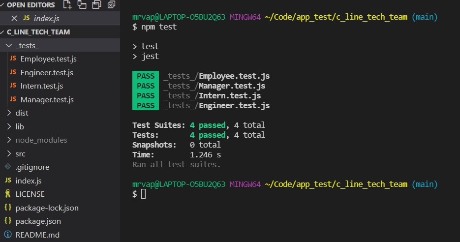

# [c_line_tech_team](https://github.com/DanielMrva/c_line_tech_team) 
  
  ## Description
  C_Line_Tech_Team is a basic proect team contact page for various technology projects.  It is designed to create very basic html pages to have team member contact data.  It is primarily built in JavaScript and is to be run in the command line.  Technologies utilized include Inquirer, Node.js, Jest (for testing).

  ## Table of Conents
   1. [Installation](#installation)
   1. [Usage](#usage)
   1. [Contribution](#contribution)
   1. [Tests](#tests)
   1. [Questions](#questions)
   1. [Links](#links)
   1. [License](#license)
  
  ## Installation
  Open github link, click on "Code" button, and copy repo link.

  In Bash navigate to desired parent directory and type "git clone" then paste the repo link.

  Open project in Node terminal or code editor and run "npm intall" to install Inquirer dependency.

  
  
  ## Usage 
  Run "npm start" to run the app.
  The prompts will guide you through the prompts to add members to your Tech Team, starting with the Manager.  Once the manager is added, you have optoins to add engineers, interns, or no additoinal members.  Selecting engineers or interns will run you through the appropriate prompts, while adding no additional members will end the application and generate your html page.

  

  ## Contribution
  Please send any questions though my Git Hub page.
  
  ## Tests
  Testing is focused on the classes used to construct objects for team members.  Run 'npm test' from the command line to run the testing suite. 

  
  
  ## Questions
  Through contact links provided on GitHub page

  Feel free to follow or contact me at my GitHub page: [DanielMrva](https://github.com/DanielMrva)
  
  
  ## Links
  [c_line_tech_team](https://github.com/DanielMrva/c_line_tech_team)

  [Video](https://watch.screencastify.com/v/NiIu2nOoXON0lsOaEFYC)

  [Example](https://danielmrva.github.io/c_line_tech_team/)
  
  ## License 
  MIT